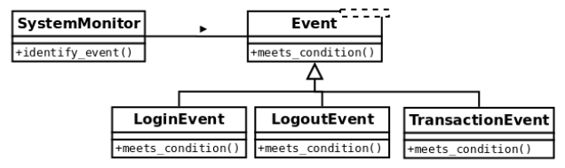

2. The open/closed principle
****************************

The **open/closed principle (OCP)** states that a module should be both open and closed (but
with respect to different aspects).

When designing a class, for instance, we should carefully encapsulate the logic so that it has
good maintenance, meaning that we will want it to be **open to extension but closed for
modification**.

What this means in simple terms is that, of course, we want our code to be extensible, to
adapt to new requirements, or changes in the domain problem. This means that, when
something new appears on the domain problem, we only want to add new things to our
model, not change anything existing that is closed to modification.

If, for some reason, when something new has to be added, we found ourselves modifying
the code, then that logic is probably poorly designed. Ideally, when requirements change,
we want to just have to extend the module with the new required behavior in order to
comply with the new requirements, but without having to modify the code.

This principle applies to several software abstractions. It could be a class or even a module.
In the following two subsections, we will see examples of each one, respectively.

2.1. Example of maintainability perils for not following the open/closed principle
++++++++++++++++++++++++++++++++++++++++++++++++++++++++++++++++++++++++++++++++++

Let's begin with an example of a system that is designed in such a way that does not follow
the open/closed principle, in order to see the maintainability problems this carries, and the
inflexibility of such a design.

The idea is that we have a part of the system that is in charge of identifying events as they
occur in another system, which is being monitored. At each point, we want this component
to identify the type of event, correctly, according to the values of the data that was
previously gathered (for simplicity, we will assume it is packaged into a dictionary, and
was previously retrieved through another means such as logs, queries, and many more).
We have a class that, based on this data, will retrieve the event, which is another type with
its own hierarchy.

A first attempt to solve this problem might look like this:

.. code-block:: python

    class Event:
        def __init__(self, raw_data):
            self.raw_data = raw_data

    class UnknownEvent(Event):
        """A type of event that cannot be identified from its data."""

    class LoginEvent(Event):
        """A event representing a user that has just entered the system."""

    class LogoutEvent(Event):
        """An event representing a user that has just left the system."""

    class SystemMonitor:
        """Identify events that occurred in the system."""
        def __init__(self, event_data):
            self.event_data = event_data

        def identify_event(self):
            if (self.event_data["before"]["session"] == 0 and
                self.event_data["after"]["session"] == 1):

                return LoginEvent(self.event_data)

            elif (self.event_data["before"]["session"] == 1 and
                  self.event_data["after"]["session"] == 0):

                  return LogoutEvent(self.event_data)

            return UnknownEvent(self.event_data)

The following is the expected behavior of the preceding code:

.. code-block:: python

    >>> l1 = SystemMonitor({"before": {"session": 0}, "after": {"session": 1}})
    >>> l1.identify_event().__class__.__name__
    'LoginEvent'
    >>> l2 = SystemMonitor({"before": {"session": 1}, "after": {"session": 0}})
    >>> l2.identify_event().__class__.__name__
    'LogoutEvent'
    >>> l3 = SystemMonitor({"before": {"session": 1}, "after": {"session": 1}})
    >>> l3.identify_event().__class__.__name__
    'UnknownEvent'

We can clearly notice the hierarchy of event types, and some business logic to construct
them. For instance, when there was no previous flag for a session, but there is now, we
identify that record as a login event. Conversely, when the opposite happens, it means that
it was a logout event. If it was not possible to identify an event, an event of type unknown
is returned. This is to preserve polymorphism by following the null object pattern (instead
of returning ``None``, it retrieves an object of the corresponding type with some default logic).

This design has some problems. The first issue is that the logic for determining the types of
events is centralized inside a monolithic method. As the number of events we want to
support grows, this method will as well, and it could end up being a very long method,
which is bad because, as we have already discussed, it will not be doing just one thing and
one thing well.

On the same line, we can see that this method is not closed for modification. Every time we
want to add a new type of event to the system, we will have to change something in this
method (not to mention, that the chain of ``elif`` statements will be a nightmare to read!).

We want to be able to add new types of event without having to change this method
(closed for modification). We also want to be able to support new types of event (open for
extension) so that when a new event is added, we only have to add code, not change the
code that already exists.

2.2. Refactoring the events system for extensibility
++++++++++++++++++++++++++++++++++++++++++++++++++++

The problem with the previous example was that the SystemMonitor class was interacting
directly with the concrete classes it was going to retrieve.

In order to achieve a design that honors the open/closed principle, we have to design
toward abstractions.

A possible alternative would be to think of this class as it collaborates with the events, and
then we delegate the logic for each particular type of event to its corresponding class:

.. figure:: ../../_static/images/ch4_good_ocp_class.png
   :width: 40%
   :align: center

Then we have to add a new (polymorphic) method to each type of event with the single
responsibility of determining if it corresponds to the data being passed or not, and we also
have to change the logic to go through all events, finding the right one.

The new code should look like this:

.. code-block:: python

    class Event:
        def __init__(self, raw_data):
            self.raw_data = raw_data

        @staticmethod
        def meets_condition(event_data: dict):
            return False

    class UnknownEvent(Event):
        """A type of event that cannot be identified from its data"""

    class LoginEvent(Event):
        @staticmethod
        def meets_condition(event_data: dict):
            return (event_data["before"]["session"] == 0 and event_data["after"]["session"] == 1)

    class LogoutEvent(Event):
        @staticmethod
        def meets_condition(event_data: dict):
            return (event_data["before"]["session"] == 1 and event_data["after"]["session"] == 0)

    class SystemMonitor:
        """Identify events that occurred in the system."""
        def __init__(self, event_data):
            self.event_data = event_data

        def identify_event(self):
            for event_cls in Event.__subclasses__():
                try:
                    if event_cls.meets_condition(self.event_data):
                        return event_cls(self.event_data)

                except KeyError:
                    continue

            return UnknownEvent(self.event_data)

Notice how the interaction is now oriented toward an abstraction (in this case, it would be
the generic base class ``Event``, which might even be an abstract base class or an interface, but
for the purposes of this example it is enough to have a concrete base class). The method no
longer works with specific types of event, but just with generic events that follow a
common interface—they are all polymorphic with respect to the ``meets_condition`` method.

Notice how events are discovered through the ``__subclasses__()`` method. Supporting
new types of event is now just about creating a new class for that event that has to inherit
from ``Event`` and implement its own ``meets_condition()`` method, according to its specific
business logic.

2.3. Extending the events system
++++++++++++++++++++++++++++++++

Now, let's prove that this design is actually as extensible as we wanted it to be. Imagine that
a new requirement arises, and we have to also support events that correspond to
transactions that the user executed on the monitored system.

The class diagram for the design has to include such a new event type, as in the following:

Only by adding the code to this new class does the logic keep working as expected:

.. code-block:: python

    class Event:
        def __init__(self, raw_data):
            self.raw_data = raw_data

        @staticmethod
        def meets_condition(event_data: dict):
            return False

    class UnknownEvent(Event):
        """A type of event that cannot be identified from its data"""

    class LoginEvent(Event):
        @staticmethod
        def meets_condition(event_data: dict):
            return (event_data["before"]["session"] == 0 and event_data["after"]["session"] == 1)

    class LogoutEvent(Event):
        @staticmethod
        def meets_condition(event_data: dict):
            return (event_data["before"]["session"] == 1 and event_data["after"]["session"] == 0)

    class TransactionEvent(Event):
        """Represents a transaction that has just occurred on the system."""
        @staticmethod
        def meets_condition(event_data: dict):
            return event_data["after"].get("transaction") is not None

    class SystemMonitor:
        """Identify events that occurred in the system."""
        def __init__(self, event_data):
            self.event_data = event_data

        def identify_event(self):
            for event_cls in Event.__subclasses__():
                try:
                    if event_cls.meets_condition(self.event_data):
                        return event_cls(self.event_data)
                except KeyError:
                    continue

            return UnknownEvent(self.event_data)

We can verify that the previous cases work as before and that the new event is also
correctly identified:

.. code-block:: python

    >>> l1 = SystemMonitor({"before": {"session": 0}, "after": {"session": 1}})
    >>> l1.identify_event().__class__.__name__
    'LoginEvent'
    >>> l2 = SystemMonitor({"before": {"session": 1}, "after": {"session": 0}})
    >>> l2.identify_event().__class__.__name__
    'LogoutEvent'
    >>> l3 = SystemMonitor({"before": {"session": 1}, "after": {"session": 1}})
    >>> l3.identify_event().__class__.__name__
    'UnknownEvent'
    >>> l4 = SystemMonitor({"after": {"transaction": "Tx001"}})
    >>> l4.identify_event().__class__.__name__
    'TransactionEvent'

Notice that the ``SystemMonitor.identify_event()`` method did not change at all when
we added the new event type. We, therefore, say that this method is closed with respect to
new types of event.

Conversely, the ``Event`` class allowed us to add a new type of event when we were required
to do so. We then say that events are open for an extension with respect to new types.

This is the true essence of this principle—when something new appears on the domain
problem, we only want to add new code, not modify existing code.

2.4. Final thoughts about the OCP
+++++++++++++++++++++++++++++++++

As you might have noticed, this principle is closely related to effective use of
polymorphism. We want to design toward abstractions that respect a polymorphic contract
that the client can use, to a structure that is generic enough that extending the model is
possible, as long as the polymorphic relationship is preserved.

This principle tackles an important problem in software engineering: maintainability. The
perils of not following the OCP are ripple effects and problems in the software where a
single change triggers changes all over the code base, or risks breaking other parts of the
code.

One important final note is that, in order to achieve this design in which we do not change
the code to extend behavior, we need to be able to create proper closure against the
abstractions we want to protect (in this example, new types of event). This is not always
possible in all programs, as some abstractions might collide (for example, we might have a
proper abstraction that provides closure against a requirement, but does not work for other
types of requirements). In these cases, we need to be selective and apply a strategy that
provides the best closure for the types of requirement that require to be the most extensible.
