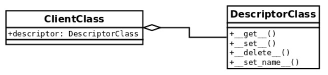

1. A first look at descriptors
******************************

First, we will explore the main idea behind descriptors to understand their mechanics and
internal workings. Once this is clear, it will be easier to assimilate how the different types of
descriptors work, which we will explore in the next section.

Once we have a first understanding of the idea behind descriptors, we will look at an
example where their use gives us a cleaner and more Pythonic implementation.

1.1. The machinery behind descriptors
+++++++++++++++++++++++++++++++++++++

The way descriptors work is not all that complicated, but the problem with them is that
there are a lot of caveats to take into consideration, so the implementation details are of the
utmost importance here.

In order to implement descriptors, we need at least two classes. For the purposes of this
generic example, we are going to call the client class to the one that is going to take
advantage of the functionality we want to implement in the descriptor (this class is
generally just a domain model one, a regular abstraction we create for our solution), and we
are going to call the descriptor class to the one that implements the logic of the
descriptor.

A descriptor is, therefore, just an object that is an instance of a class that implements the
descriptor protocol. This means that this class must have its interface containing at least one
of the following magic methods (part of the descriptor protocol as of Python 3.6+):

- ``__get__(self, obj, owner=None)``: This is called whenever the attribute is
  read (referred to as a ``getter``)
- ``__set__(self, obj, value)``: .This is called whenever the attribute is set. In
  the following examples, I will refer to this as a ``setter``.
- ``__delete__(self, obj)``: This is called when ``del`` is invoked on the attribute.
- ``__set_name__(self, owner, name)``

A descriptor that implements ``__get__()`` and ``__set__()`` is called a data descriptor. If it
just implements ``__get__()``, then it is called a non-data descriptor.

Methods of this protocol are, in fact, called by the object's
special ``__getattribute__()`` method (do not confuse it with ``__getattr__()``, which has
a different purpose) on every attribute lookup. Whenever such a lookup is performed,
either by using a dotted notation in the form of ``instance.attribute``, or by using
the ``getattr(instance, 'attribute')`` function call, the ``__getattribute__()`` method
is implicitly invoked and it looks for an attribute in the following order:

1. It verifies whether the attribute is a data descriptor on the class object of the
   instance.
2. If not, it looks to see whether the attribute can be found in
   the ``__dict__`` lookup of the instance object.
3. Finally, it looks to see whether the attribute is a non-data descriptor on the class
   object of the instance.

In other words, data descriptors take precedence over ``__dict__`` lookup,
and ``__dict__`` lookup takes precedence over non-data descriptors. Without ``__dict__``
taking precedence over non-data descriptors, we would not be able
to dynamically override specific methods on already constructed instances at runtime.
Fortunately, thanks to how descriptors work in Python, it is possible; so, developers may
use a popular technique called monkey patching to change the way in which instances
work without the need for subclassing.

For the purposes of this initial high-level introduction, the following naming convention
will be used:

- `ClientClass`: The domain-level abstraction that will take advantage of the functionality to be implemented by the descriptor. This class is said to be a client of the descriptor. This class contains a class attribute (named descriptor by this convention), which is an instance of `DescriptorClass`.
- `DescriptorClass`: The class that implements the descriptor itself. This class should implement some of the aforementioned magic methods that entail the descriptor protocol.
- `client`: An instance of `ClientClass`. ``client = ClientClass()``
- `descriptor`: An instance of `DescriptorClass`. ``descriptor = DescriptorClass()``. This object is a class attribute that is placed in `ClientClass`.

This relationship is illustrated in the following diagram:

A very important observation to keep in mind is that for this protocol to work, the
`descriptor` object has to be defined as a class attribute. Creating this object as an instance
attribute will not work, so it must be in the body of the class, and not in the ``init`` method.

.. note:: Always place the `descriptor` object as a class attribute!

On a slightly critical note, readers can also note that it is possible to implement the
descriptor protocol partially: not all methods must always be defined; instead, we can
implement only those we need, as we will see shortly.

So, now we have the structure in place: we know what elements are set and how they
interact. We need a class for the `descriptor`, another class that will consume the logic of
the `descriptor`, which, in turn, will have a `descriptor` object (an instance of the
`DescriptorClass`) as a class attribute, and instances of `ClientClass` that will follow the
descriptor protocol when we call for the attribute named ``descriptor``. But now what?
How does all of this fit into place at runtime?

Normally, when we have a regular class and we access its attributes, we simply obtain the
objects as we expect them, and even their properties, as in the following example:

.. code-block:: python

    >>> class Attribute:
    ...     value = 42
    ...
    >>> class Client:
    ...     attribute = Attribute()
    ...
    >>> Client().attribute
    <__main__.Attribute object at 0x7ff37ea90940>
    >>> Client().attribute.value
    42

But, in the case of descriptors, something different happens. When an object is defined as a
class attribute (and this one is a `descriptor`), when a client requests this attribute,
instead of getting the object itself (as we would expect from the previous example), we get
the result of having called the ``__get__`` magic method.

Let's start with some simple code that only logs information about the context, and returns
the same `client` object:

.. code-block:: python

    class DescriptorClass:

        def __get__(self, instance, owner):
            if instance is None:
                return self

            logger.info("Call: %s.__get__(%r, %r)",
            self.__class__.__name__,instance, owner)
            return instance

    class ClientClass:
        descriptor = DescriptorClass()

When running this code, and requesting the descriptor attribute of an instance of
`ClientClass`, we will discover that we are, in fact, not getting an instance of
`DescriptorClass`, but whatever its __get__() method returns instead:

.. code-block:: python

    >>> client = ClientClass()
    >>> client.descriptor
    INFO:Call: DescriptorClass.__get__(<ClientClass object at 0x...>, <class 'ClientClass'>)
    <ClientClass object at 0x...>
    >>> client.descriptor is client
    INFO:Call: DescriptorClass.__get__(ClientClass object at 0x...>, <class 'ClientClass'>)
    True

Notice how the logging line, placed under the ``__get__`` method, was called instead of just
returning the object we created. In this case, we made that method return the `client` itself,
hence making true a comparison of the last statement. The parameters of this method are
explained in more detail in the following subsections when we explore each method in
more detail.

Starting from this simple, yet demonstrative example, we can start creating more complex
abstractions and better decorators, because the important note here is that we have a new
(powerful) tool to work with. Notice how this changes the control flow of the program in a
completely different way. With this tool, we can abstract all sorts of logic behind the
``__get__`` method, and make the `descriptor` transparently run all sorts of transformations
without clients even noticing. This takes encapsulation to a new level.

1.2. Exploring each method of the descriptor protocol
+++++++++++++++++++++++++++++++++++++++++++++++++++++

Up until now, we have seen quite a few examples of descriptors in action, and we got the
idea of how they work. These examples gave us a first glimpse of the power of descriptors,
but you might be wondering about some implementation details and idioms whose
explanation we failed to address.

Since descriptors are just objects, these methods take ``self`` as the first parameter. For all of
them, this just means the descriptor object itself.

In this section, we will explore each method of the descriptor protocol, in full detail,
explaining what each parameter signifies, and how they are intended to be used.

1.2.1. __get__(self, instance, owner)
-------------------------------------

The first parameter, ``instance``, refers to the object from which the `descriptor` is being
called. In our first example, this would mean the `client` object.

The ``owner`` parameter is a reference to the class of that object, which following our example
would be `ClientClass`.

From the previous paragraph we conclude that the parameter named ``instance`` in the
signature of ``__get__`` is the object over which the `descriptor` is taking action, and ``owner`` is
the class of ``instance``. The avid reader might be wondering why is the signature define like
this, after all the class can be taken from ``instance`` directly (``owner = instance.__class__``). There is an edge case:
when the `descriptor` is called from the class (`ClientClass`), not from the instance (`client`), then the value of ``instance`` is None,
but we might still want to do some processing in that case.

With the following simple code we can demonstrate the difference of when a descriptor is
being called from the class, or from an instance. In this case, the ``__get__`` method is doing
two separate things for each case.

.. code-block:: python

    class DescriptorClass:
        def __get__(self, instance, owner):
            if instance is None:
                return f"{self.__class__.__name__}.{owner.__name__}"
            return f"value for {instance}"

    class ClientClass:
        descriptor = DescriptorClass()

When we call it from `ClientClass` directly it will do one thing, which is composing a
namespace with the names of the classes:

.. code-block:: python

    >>> ClientClass.descriptor
    'DescriptorClass.ClientClass'

And then if we call it from an object we have created, it will return the other message
instead:

.. code-block:: python

    >>> ClientClass().descriptor
    'value for <descriptors_methods_1.ClientClass object at 0x...>'

In general, unless we really need to do something with the ``owner`` parameter, the most
common idiom, is to just return the descriptor itself, when instance is None.

1.2.2. __set__(self, instance, value)
-------------------------------------

This method is called when we try to assign something to a `descriptor`. It is activated
with statements such as the following, in which a `descriptor` is an object that implements
``__set__()``. The ``instance`` parameter, in this case, would be `client`, and
the value would be the "value" string: ``client.descriptor = "value"``

If ``client.descriptor`` doesn't implement ``__set__()``, then "value" will override the
descriptor entirely.

.. note:: Be careful when assigning a value to an attribute that is a descriptor. Make sure it implements the ``__set__`` method, and that we are not causing an undesired side effect.

By default, the most common use of this method is just to store data in an object.
Nevertheless, we have seen how powerful descriptors are so far, and that we can take
advantage of them, for example, if we were to create generic validation objects that can be
applied multiple times (again, this is something that if we don't abstract, we might end up
repeating multiple times in setter methods of properties).

The following listing illustrates how we can take advantage of this method in order to
create generic validation objects for attributes, which can be created dynamically with
functions to validate on the values before assigning them to the object:

.. code-block:: python

    class Validation:

        def __init__(self, validation_function, error_msg: str):
            self.validation_function = validation_function
            self.error_msg = error_msg

        def __call__(self, value):
            if not self.validation_function(value):
                raise ValueError(f"{value!r} {self.error_msg}")

    class Field:

        def __init__(self, *validations):
            self._name = None
            self.validations = validations

        def __set_name__(self, owner, name):
            self._name = name

        def __get__(self, instance, owner):
            if instance is None:
                return self

            return instance.__dict__[self._name]

        def validate(self, value):
            for validation in self.validations:
                validation(value)

        def __set__(self, instance, value):
            self.validate(value)
            instance.__dict__[self._name] = value

    class ClientClass:
        descriptor = Field(
            Validation(lambda x: isinstance(x, (int, float)), "is not a number"),
            Validation(lambda x: x >= 0, "is not >= 0")
        )

We can see this object in action in the following listing:

.. code-block:: python

    >>> client = ClientClass()
    >>> client.descriptor = 42
    >>> client.descriptor
    42
    >>> client.descriptor = -42
    Traceback (most recent call last):
    ...
    ValueError: -42 is not >= 0
    >>> client.descriptor = "invalid value"
    ...
    ValueError: 'invalid value' is not a number

The idea is that something that we would normally place in a property can be abstracted
away into a `descriptor`, and reuse it multiple times. In this case, the ``__set__()`` method
would be doing what the ``@property.setter`` would have been doing.

1.2.3. __delete__(self, instance)
---------------------------------

This method is called upon with the following statement, in which ``self`` would be the
`descriptor` attribute, and ``instance`` would be the client object in this example:

.. code-block:: python

    >>> del client.descriptor

In the following example, we use this method to create a `descriptor` with the goal of
preventing you from removing attributes from an object without the required
administrative privileges. Notice how, in this case, that the `descriptor` has logic that is
used to predicate with the values of the object that is using it, instead of different related
objects:

.. code-block:: python

    class ProtectedAttribute:

        def __init__(self, requires_role=None) -> None:
            self.permission_required = requires_role
            self._name = None

        def __set_name__(self, owner, name):
            self._name = name

        def __set__(self, user, value):
            if value is None:
                raise ValueError(f"{self._name} can't be set to None")

            user.__dict__[self._name] = value

        def __delete__(self, user):
            if self.permission_required in user.permissions:
                user.__dict__[self._name] = None
            else:
                raise ValueError(f"User {user!s} doesn't have {self.permission_required} permission")

    class User:
        """Only users with "admin" privileges can remove their email
        address."""

        email = ProtectedAttribute(requires_role="admin")

        def __init__(self, username: str, email: str, permission_list: list = None) -> None:
            self.username = username
            self.email = email
            self.permissions = permission_list or []

        def __str__(self):
            return self.username

Before seeing examples of how this object works, it's important to remark some of the
criteria of this descriptor. Notice the ``User`` class requires the ``username`` and ``email`` as
mandatory parameters. According to its ``__init__`` method, it cannot be a user if it doesn't
have an email attribute. If we were to delete that attribute, and extract it from the object
entirely we would be creating an inconsistent object, with some invalid intermediate state
that does not correspond to the interface defined by the class ``User``. Details like this one are
really important, in order to avoid issues. Some other object is expecting to work with this
``User``, and it also expects that it has an email attribute.

For this reason, it was decided that the "deletion" of an email will just simply set it to None. For the same reason, we must forbid
someone trying to set a None value to it, because that would bypass the mechanism we placed in the ``__delete__ method``.

Here, we can see it in action, assuming a case where only users with "admin" privileges
can remove their email address:

.. code-block:: python

    >>> admin = User("root", "root@d.com", ["admin"])
    >>> user = User("user", "user1@d.com", ["email", "helpdesk"])
    >>> admin.email
    'root@d.com'
    >>> del admin.email
    >>> admin.email is None
    True
    >>> user.email
    'user1@d.com'
    >>> user.email = None
    ValueError: email can't be set to None
    >>> del user.email
    ValueError: User user doesn't have admin permission

Here, in this simple `descriptor`, we see that we can delete the email from users that
contain the "admin" permission only. As for the rest, when we try to call ``del`` on that
attribute, we will get a ``ValueError`` exception.

In general, this method of the `descriptor` is not as commonly used as the two previous ones,
but it is worth showing it for completeness.

1.2.4. __set_name__(self, owner, name)
--------------------------------------

When we create the `descriptor` object in the class that is going to use it, we generally
need the `descriptor` to know the name of the attribute it is going to be handling.

This attribute name is the one we use to read from and write to ``__dict__`` in the ``__get__``
and ``__set__`` methods, respectively.

Before Python 3.6, the descriptor couldn't take this name automatically, so the most general
approach was to just pass it explicitly when initializing the object. This works fine, but it
has an issue in that it requires that we duplicate the name every time we want to use the
descriptor for a new attribute.

This is what a typical `descriptor` would look like if we didn't have this method:

.. code-block:: python

    class DescriptorWithName:

        def __init__(self, name):
            self.name = name

        def __get__(self, instance, value):
            if instance is None:
                return self

            logger.info("getting %r attribute from %r", self.name, instance)
            return instance.__dict__[self.name]

        def __set__(self, instance, value):
            instance.__dict__[self.name] = value

    class ClientClass:
        descriptor = DescriptorWithName("descriptor")

We can see how the descriptor uses this value:

.. code-block:: python

    >>> client = ClientClass()
    >>> client.descriptor = "value"
    >>> client.descriptor
    INFO:getting 'descriptor' attribute from <ClientClass object at 0x...>
    'value'

Now, if we wanted to avoid writing the name of the attribute twice (once for the variable
assigned inside the class, and once again as the name of the first parameter of the
descriptor), we have to resort to a few tricks, like using a class decorator, or (even worse)
using a metaclass.

In Python 3.6, the new method ``__set_name__`` was added, and it receives the class where
that descriptor is being created, and the name that is being given to that descriptor. The
most common idiom is to use this method for the descriptor so that it can store the required
name in this method.

For compatibility, it is generally a good idea to keep a default value in the ``__init__``
method but still take advantage of ``__set_name__``.

With this method, we can rewrite the previous descriptors as follows:

.. code-block:: python

    class DescriptorWithName:
        def __init__(self, name=None):
            self.name = name

        def __set_name__(self, owner, name):
            self.name = name

        ...
