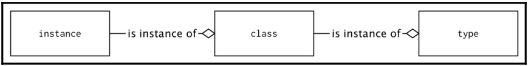
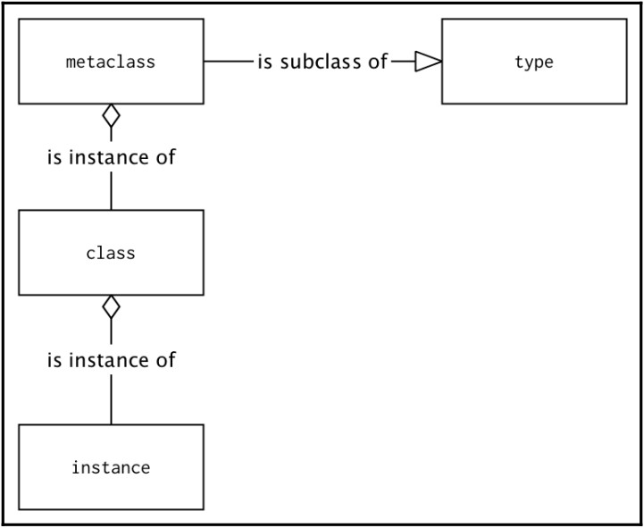

5. Metaclasses
**************

Metaclass is a Python feature that is considered by many as one of the most difficult things
to understand in this language and thus avoided by a great number of developers. In
reality, it is not as complicated as it sounds once you understand a few basic concepts. As a
reward, knowing how to use metaclasses grants you the ability to do things that are not
possible without them.

Metaclass is a type (class) that defines other types (classes). The most important thing to
know in order to understand how they work is that classes that define object instances are
objects too. So, if they are objects, then they have an associated class. The basic type of
every class definition is simply the built-in ``type`` class. Here is a simple diagram that should
make this clear:

In Python, it is possible to substitute the metaclass for a class object with our own type.
Usually, the new metaclass is still the subclass of the ``type`` class because
not doing so would make the resulting classes highly incompatible with other classes in
terms of inheritance:

5.1. The general syntax
+++++++++++++++++++++++

The call to the built-in ``type()`` class can be used as a dynamic equivalent of the class
statement. The following is an example of a class definition with the ``type()`` call:

.. code-block:: python

    def method(self):
        return 1

    MyClass = type('MyClass', (object,), {'method': method})

This is equivalent to the explicit definition of the class with the ``class`` keyword:

.. code-block:: python

    class MyClass:
        def method(self):
            return 1

Every class that's created with the ``class`` statement implicitly uses ``type`` as its metaclass. This
default behavior can be changed by providing the ``metaclass`` keyword argument to the
class statement, as follows:

.. code-block:: python

    class ClassWithAMetaclass(metaclass=type):
        pass

The value that's provided as a ``metaclass`` argument is usually another class object, but it
can be any other callable that accepts the same arguments as the ``type`` class and is expected
to return another class object. The call signature is ``type(name, bases, namespace)`` and
the meaning of the arguments are as follows:

- ``name``: This is the name of the class that will be stored in the ``__name__`` attribute
- ``bases``: This is the list of parent classes that will become the ``__bases__`` attribute and will be used to construct the MRO of a newly created class
- ``namespace``: This is a namespace (mapping) with definitions for the class body that will become the ``__dict__`` attribute

One way of thinking about metaclasses is the ``__new__()`` method, but at a higher level of
class definition.

Despite the fact that functions that explicitly call ``type()`` can be used in place of
metaclasses, the usual approach is to use a different class that inherits from type for this
purpose. The common template for a metaclass is as follows:

.. code-block:: python

    class Metaclass(type):
        def __new__(mcs, name, bases, namespace):
            return super().__new__(mcs, name, bases, namespace)

        @classmethod
        def __prepare__(mcs, name, bases, **kwargs):
            return super().__prepare__(name, bases, **kwargs)

        def __init__(cls, name, bases, namespace, **kwargs):
            super().__init__(name, bases, namespace)

        def __call__(cls, *args, **kwargs):
            return super().__call__(*args, **kwargs)

The ``name``, ``bases``, and ``namespace`` arguments have the same meaning as in the ``type()`` call
we explained earlier, but each of these four methods can have the following different
purposes:

- ``__new__(mcs, name, bases, namespace)``: This is responsible for the actual creation of the class object in the same way as it does for ordinary classes. The first positional argument is a metaclass object. In the preceding example, it would simply be a ``Metaclass``. Note that ``mcs`` is the popular naming convention for this argument.
- ``__prepare__(mcs, name, bases, **kwargs)``: This creates an empty namespace object. By default, it returns an empty ``dict``, but it can be overridden to return any other mapping type. Note that it does not accept ``namespace`` as an argument because, before calling it, the namespace does not exist.
- ``__init__(cls, name, bases, namespace, **kwargs)``: This is not seen popularly in metaclass implementations but has the same meaning as in ordinary classes. It can perform additional class object initialization once it is created with ``__new__()``. The first positional argument is now named ``cls`` by convention to mark that this is already a created class object (metaclass instance) and not a metaclass object. When ``__init__()`` was called, the class was already constructed and so this method can do less things than the ``__new__()`` method. Implementing such a method is very similar to using class decorators, but the main difference is that ``__init__()`` will be called for every subclass, while class decorators are not called for subclasses.
- ``__call__(cls, *args, **kwargs)``: This is called when an instance of a metaclass is called. The instance of a metaclass is a class object; it is invoked when you create new instances of a class. This can be used to override the default way of how class instances are created and initialized.

Each of the preceding methods can accept additional extra keyword arguments, all of
which are represented by ``**kwargs``. These arguments can be passed to the metaclass object
using extra keyword arguments in the class definition in the form of the following code:

.. code-block:: python

    class Klass(metaclass=Metaclass, extra="value"):
        pass

This amount of information can be overwhelming at the beginning without proper
examples, so let's trace the creation of metaclasses, classes, and instances with
some ``print()`` calls:

.. code-block:: python

    class RevealingMeta(type):
        def __new__(mcs, name, bases, namespace, **kwargs):
            print(mcs, "__new__ called")
            return super().__new__(mcs, name, bases, namespace)

        @classmethod
        def __prepare__(mcs, name, bases, **kwargs):
            print(mcs, "__prepare__ called")
            return super().__prepare__(name, bases, **kwargs)

        def __init__(cls, name, bases, namespace, **kwargs):
            print(cls, "__init__ called")
            super().__init__(name, bases, namespace)

        def __call__(cls, *args, **kwargs):
            print(cls, "__call__ called")
            return super().__call__(*args, **kwargs)

Using ``RevealingMeta`` as a metaclass to create a new class definition will give the
following output in the Python interactive session:

.. code-block:: python

    >>> class RevealingClass(metaclass=RevealingMeta):
    ...     def __new__(cls):
    ...         print(cls, "__new__ called")
    ...         return super().__new__(cls)
    ...     def __init__(self):
    ...         print(self, "__init__ called")
    ...         super().__init__()
    ...
    <class 'RevealingMeta'> __prepare__ called
    <class 'RevealingMeta'> __new__ called
    <class 'RevealingClass'> __init__ called
    >>> instance = RevealingClass()
    <class 'RevealingClass'> __call__ called <class 'RevealingClass'> __new__
    called <RevealingClass object at 0x1032b9fd0> __init__ called

5.2. Metaclass usage
++++++++++++++++++++

Metaclasses, once mastered, are a powerful feature, but always complicate the code.
Metaclasses also do not compose well and you'll quickly run into problems if you try to mix
multiple metaclasses through inheritance.

For simple things, like changing the read/write attributes or adding new ones, metaclasses
can be avoided in favor of simpler solutions, such as properties, descriptors, or class
decorators.

But there are situations where things cannot be easily done without them. For instance, it is
hard to imagine Django's ORM implementation built without extensive use of metaclasses.
It could be possible, but it is rather unlikely that the resulting solution would be similarly
easy to use. Frameworks are the place where metaclasses really shine. They usually have a
lot of complex internal code that is not easy to understand and follow, but eventually allow
other programmers to write more condensed and readable code that operates on a higher
level of abstraction.

5.3. Metaclass pitfalls
+++++++++++++++++++++++

Like some other advanced Python features, the metaclasses are very elastic and can be
easily abused. While the call signature of the class is rather strict, Python does not enforce
the type of the return parameter. It can be anything as long as it accepts incoming
arguments on calls and has the required attributes whenever it is needed.

One such object that can be *anything-anywhere* is the instance of the ``Mock`` class that's
provided in the ``unittest.mock`` module. ``Mock`` is not a metaclass and also does not inherit
from the ``type`` class. It also does not return the class object on instantiating. Still, it can be
included as a metaclass keyword argument in the class definition, and this will not raise
any syntax errors. Using ``Mock`` as a metaclass is, of course, complete nonsense, but let's
consider the following example:

.. code-block:: python

    >>> from unittest.mock import Mock
    >>> class Nonsense(metaclass=Mock):
    ...     pass
    ...
    >>> Nonsense
    <Mock spec='str' id='4327214664'>
    # pointless, but illustrative

It's not hard to predict that any attempt to instantiate our Nonsense pseudo-class will fail.
What is really interesting is the following exception and traceback you'll get trying to do so:

.. code-block:: python

    >>> Nonsense()
    Traceback (most recent call last):
    File "<stdin>", line 1, in <module>
    File
    "/Library/Frameworks/Python.framework/Versions/3.5/lib/python3.5/unittest/mock.py", line 917, in __call__
        return _mock_self._mock_call(*args, **kwargs)
    File
    "/Library/Frameworks/Python.framework/Versions/3.5/lib/python3.5/unittest/mock.py", line 976, in _mock_call
        result = next(effect)
    StopIteration

Does the ``StopIteration`` exception give you any clue that there may be a problem with
our class definition on the metaclass level? Obviously not. This example illustrates how
hard it may be to debug metaclass code if you don't know where to look for errors.
