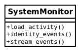
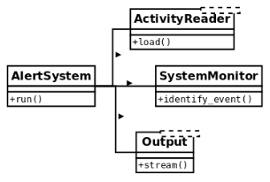

1. Single responsibility principle
**********************************

The **single responsibility principle (SRP)** states that a software component (in general, a
class) must have only one responsibility. The fact that the class has a sole responsibility
means that it is in charge of doing just one concrete thing, and as a consequence of that, we
can conclude that it must have only one reason to change.

Only if one thing on the domain problem changes will the class have to be updated. If we
have to make modifications to a class, for different reasons, it means the abstraction is
incorrect, and that the class has too many responsibilities.T

This design principle helps us build more cohesive abstractions; objects that do one thing, and just one
thing, well, following the Unix philosophy. What we want to avoid in all cases is having objects with multiple
responsibilities (often called **god-objects**, because they know too much, or more than they
should). These objects group different (mostly unrelated) behaviors, thus making them
harder to maintain.

Again, the smaller the class, the better.

The SRP is closely related to the idea of cohesion in software design, which we already
explored, when we discussed separation of concerns in software. What we strive to achieve here is that classes
are designed in such a way that most of their properties and their attributes are used by its methods, most of
the time. When this happens, we know they are related concepts, and therefore it makes sense
to group them under the same abstraction.

In a way, this idea is somehow similar to the concept of normalization on relational
database design. When we detect that there are partitions on the attributes or methods of
the interface of an object, they might as well be moved somewhere else—it is a sign that
they are two or more different abstractions mixed into one.

There is another way of looking at this principle. If, when looking at a class, we find
methods that are mutually exclusive and do not relate to each other, they are the different
responsibilities that have to be broken down into smaller classes.

1.1. A class with too many responsibilities
+++++++++++++++++++++++++++++++++++++++++++

In this example, we are going to create the case for an application that is in charge of
reading information about events from a source (this could be log files, a database, or many
more sources), and identifying the actions corresponding to each particular log.
A design that fails to conform to the SRP would look like this:

Without considering the implementation, the code for the class might look in the following
listing:

.. code-block:: python

    class SystemMonitor:

        def load_activity(self):
        """Get the events from a source, to be processed."""

        def identify_events(self):
        """Parse the source raw data into events (domain objects)."""

        def stream_events(self):
        """Send the parsed events to an external agent."""

The problem with this class is that it defines an interface with a set of methods that
correspond to actions that are orthogonal: each one can be done independently of the rest.

This design flaw makes the class rigid, inflexible, and error-prone because it is hard to
maintain. In this example, each method represents a responsibility of the class. Each
responsibility entails a reason why the class might need to be modified. In this case, each
method represents one of the various reasons why the class will have to be modified.

Consider the loader method, which retrieves the information from a particular source.
Regardless of how this is done (we can abstract the implementation details here), it is clear
that it will have its own sequence of steps, for instance connecting to the data source,
loading the data, parsing it into the expected format, and so on. If any of this changes (for
example, we want to change the data structure used for holding the data), the
SystemMonitor class will need to change. Ask yourself whether this makes sense. Does a
system monitor object have to change because we changed the representation of the data?
No.

The same reasoning applies to the other two methods. If we change how we fingerprint
events, or how we deliver them to another data source, we will end up making changes to
the same class.

It should be clear by now that this class is rather fragile, and not very maintainable. There
are lots of different reasons that will impact on changes in this class. Instead, we want
external factors to impact our code as little as possible. The solution, again, is to create
smaller and more cohesive abstractions.

1.2. Distributing responsibilities
++++++++++++++++++++++++++++++++++

To make the solution more maintainable, we separate every method into a different class.
This way, each class will have a single responsibility:

The same behavior is achieved by using an object that will interact with instances of these
new classes, using those objects as collaborators, but the idea remains that each class
encapsulates a specific set of methods that are independent of the rest. The idea now is that
changes on any of these classes do not impact the rest, and all of them have a clear and
specific meaning. If we need to change something on how we load events from the data
sources, the alert system is not even aware of these changes, so we do not have to modify
anything on the system monitor (as long as the contract is still preserved), and the data
target is also unmodified.

Changes are now local, the impact is minimal, and each class is easier to maintain.

The new classes define interfaces that are not only more maintainable but also reusable.
Imagine that now, in another part of the application, we also need to read the activity from
the logs, but for different purposes. With this design, we can simply use objects of type
``ActivityReader`` (which would actually be an interface, but for the purposes of this
section, that detail is not relevant and will be explained later for the next principles). This
would make sense, whereas it would not have made sense in the previous design, because
attempts to reuse the only class we had defined would have also carried extra methods
(such as ``identify_events()``, or ``stream_events()``) that were not needed at all.

One important clarification is that the principle does not mean at all that each class must
have a single method. Any of the new classes might have extra methods, as long as they
correspond to the same logic that that class is in charge of handling.
